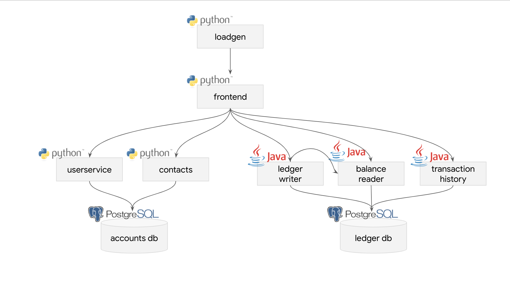

# Bank of Anthos

Modified from the original **[Bank of Anthos repo](https://github.com/GoogleCloudPlatform/bank-of-anthos)** which is a sample HTTP-based web app that simulates a bank's payment processing network, allowing users to create artificial bank accounts and complete transactions.

## Service Architecture

This repo modifies this into a multi-repository microservices design to demonstrate `skaffold`'s ability to support per-application `skaffold.yaml` configuration file.



| Service                                          | Language      | Description                                                                                                                                  |
| ------------------------------------------------ | ------------- | -------------------------------------------------------------------------------------------------------------------------------------------- |
| [frontend](https://github.com/gsquared94/bank-of-anthos-frontend)                       | Python        | Exposes an HTTP server to serve the website. Contains login page, signup page, and home page.                                                |
| [ledger-writer](https://github.com/gsquared94/bank-of-anthos-ledgerwriter)              | Java          | Accepts and validates incoming transactions before writing them to the ledger.                                                               |
| [balance-reader](https://github.com/gsquared94/bank-of-anthos-balancereader)            | Java          | Provides efficient readable cache of user balances, as read from `ledger-db`.                                                                |
| [transaction-history](https://github.com/gsquared94/bank-of-anthos-transactionhistory)  | Java          | Provides efficient readable cache of past transactions, as read from `ledger-db`.                                                            |
| [ledger-db](https://github.com/gsquared94/bank-of-anthos-ledger-db)                     | PostgreSQL | Ledger of all transactions. Option to pre-populate with transactions for demo users.                                                         |
| [user-service](https://github.com/gsquared94/bank-of-anthos-userservice)                | Python        | Manages user accounts and authentication. Signs JWTs used for authentication by other services.                                              |
| [contacts](https://github.com/gsquared94/bank-of-anthos-contacts)                       | Python        | Stores list of other accounts associated with a user. Used for drop down in "Send Payment" and "Deposit" forms. |
| [accounts-db](https://github.com/gsquared94/bank-of-anthos-accounts)                 | PostgreSQL | Database for user accounts and associated data. Option to pre-populate with demo users.                                                      |
| [loadgenerator](https://github.com/gsquared94/bank-of-anthos-loadgenerator)             | Python/Locust | Continuously sends requests imitating users to the frontend. Periodically creates new accounts and simulates transactions between them.      |


## Quickstart

[](https://ssh.cloud.google.com/cloudshell/editor?cloudshell_git_repo=https://github.com/gsquared94/bank-of-anthos-demo&cloudshell_tutorial=README.md#Quickstart)


1. **[Create a Google Cloud Platform project](https://cloud.google.com/resource-manager/docs/creating-managing-projects#creating_a_project)** or use an existing project. Set the `PROJECT_ID` environment variable and ensure the Google Kubernetes Engine API is enabled.

```
PROJECT_ID=""
gcloud services enable container --project ${PROJECT_ID}
```

2. **Clone this repository.**

```
git clone https://github.com/gsquared94/bank-of-anthos-demo.git
cd bank-of-anthos
```

3. **Create a Kubernetes cluster.**   
* Create a GKE cluster 
```
ZONE=us-central1-b
gcloud beta container clusters create bank-of-anthos \
--project=${PROJECT_ID} --zone=${ZONE} \
--machine-type=e2-standard-2 --num-nodes=4 \
--enable-stackdriver-kubernetes --subnetwork=default \
--tags=bank-of-anthos --labels csm=
```
* Alternately, if using the Cloud Shell IDE create a minikube cluster
```
minikube start
```

4. **Clone all submodule projects**
```
git submodule update --init --force --remote
```
5. **Deploy the sample app to the cluster.**

```
skaffold run -f final_skaffold.yaml
```
6. **Iterate on only selected services by passing the `-m` flag.**
```
skaffold dev -f final_skaffold.yaml -m frontend -m balancereader
```